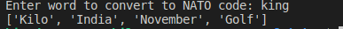

# Day26

## Lessons learned today

- List comprehensions
```
new_list = [item for item in old_list if item > 50]

```
- Dictionary Comprehensions
```
new_dict = {key:value + 2  for(key,value) in old_dict.items() }
```


## Project to solidify material learned: 

### Preview:



### NATO_Alphabet

> A simple programme that takes in name and prints the message using NATO alphabet

## How to run this on your device

- Clone this repository
```
git clone https://github.com/kingdreamerr/Day26_NATO_Alphabet.git
```
- cd into the repo
```
cd Day26_NATO_Alphabet
```

- Paste the following in the terminal 
```
python3 main.py
```